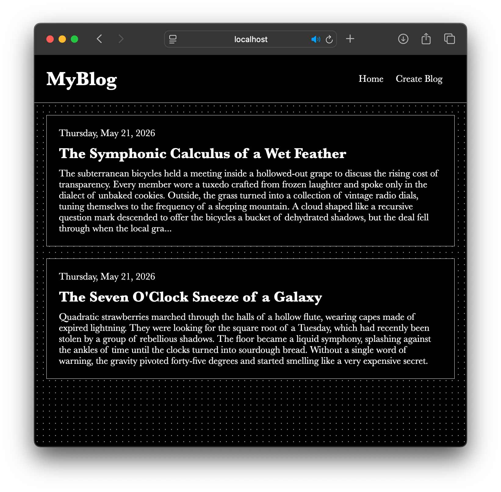
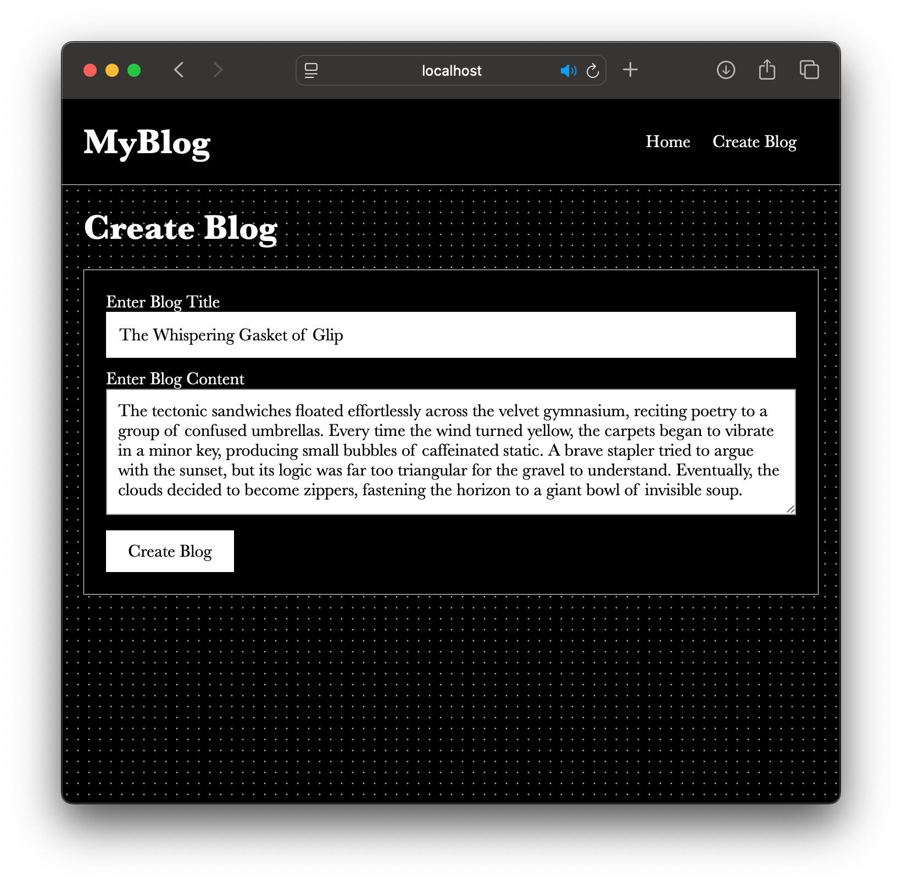
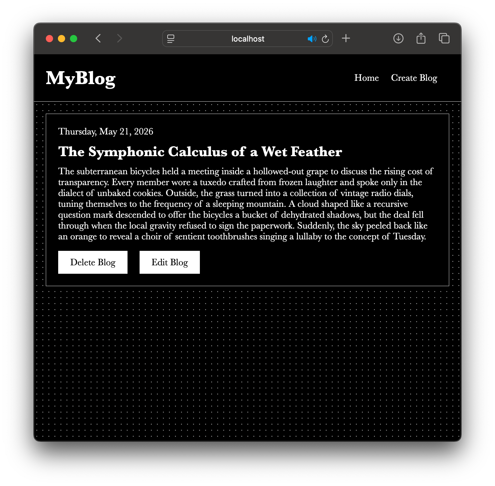

# MyBlog

MyBlog is a simple full-stack blog application built with Node.js, Express, and EJS. Users can create, view, edit, and delete blog posts through a clean server-rendered interface.

## Screenshots

### Home Page

### Create Blog Page

### View Blog Page

## Features

- Create new blog posts
- View all blog posts on the home page
- Open individual blog posts
- Edit existing blog posts
- Delete blog posts
- Server-rendered pages using EJS
- Custom styling with CSS

## Tech Stack

- Node.js
- Express.js
- EJS
- CSS

## Getting Started

### 1. Clone the repository

`git clone https://github.com/Zacharyrg25/myblog.git`

### 2. `cd` into the project folder

### 3. Install dependencies

`npm i -y`

### 4. Start the app

`node --watch index.js`

### 5. Open the app

Visit this URL in your browser: http://localhost:3000

## Project Structure

    .
    ├── index.js
    ├── package.json
    ├── package-lock.json
    ├── public
    │   └── styles
    │       └── main.css
    └── views
        ├── create.ejs
        ├── home.ejs
        ├── view.ejs
        └── partials
            ├── header.ejs
            └── footer.ejs

## Note

This project stores blog posts in memory, so posts will reset when the server restarts. It was built as a beginner-friendly full-stack project to practice Node.js, Express routing, EJS templates, and basic CRUD functionality.